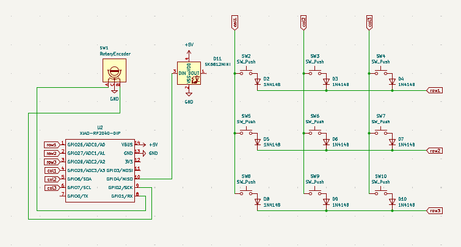
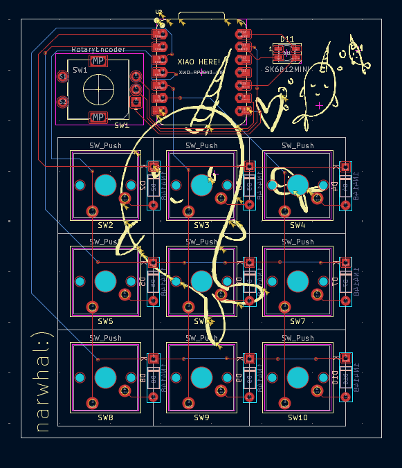
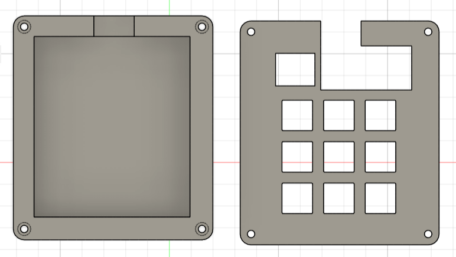
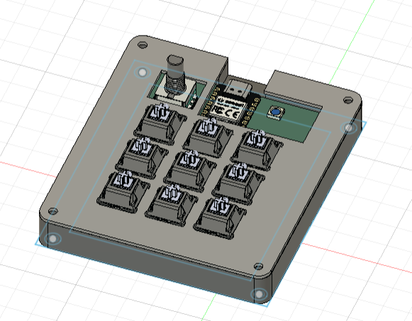

# narwhal

A macropad with 9 keys, 1 EC11 Rotary Encoder, 9 through-hole 1N4148 Diodes, and 1 SK6812 MINI.

## PCB

Utilized a matrix setup for the switches and used diodes for backlight. Added narhwals on the silkscreen.

## CAD

I had a little problem with fitting the encoder into the case. Eventually left a little bit of space so
pcb can be seen underneath, both near the rotary encoder and next to the XIAO and neopixel.

## Firmware

Used kmk for firmware. Rotary encoder increases/decreases the volume. Currently have a basic setup for key mapping but will likely change them to macros later.

## BOM

1 x Seeed XIAO RP2040

9 x 1N4148 Diodes

9 x MX-Style switches

1 x EC11 Rotary encoder

9 x Blank DSA keycaps

1 x SK6812 MINI-E LED
